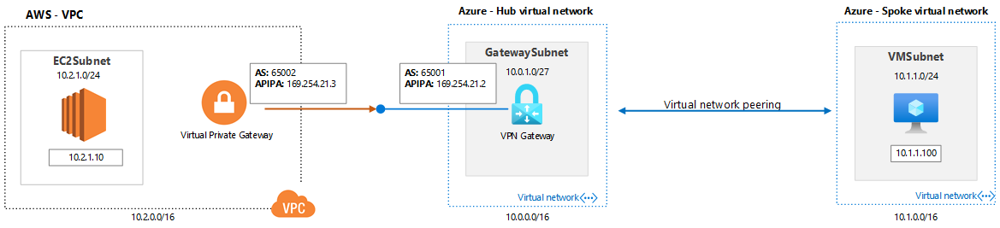

# Azure Labs (Networking) - Hub-Spoke design - Azure VPN Gateway to AWS VPG with IKEv2 and BGP

## Introduction
This lab will guide you how to build a IPSEC VPN tunnel w/IKEv2 between a AWS VPG and the Azure VPN gateway with BGP. Before you had to use just static route to establish site-to-site between Azure and AWS, now it is possible to use the BGP and APIPA address space.

 All Azure configs are done in Azure CLI and, you can change them as needed to match your environment. 

 **References:**</br>
 [How to configure BGP on Azure VPN Gateways](https://docs.microsoft.com/en-us/azure/vpn-gateway/bgp-howto)

## Prerequisites

- Install the Az CLI [Install the Azure CLI](https://docs.microsoft.com/pt-br/cli/azure/install-azure-cli) or use the [Azure Cloud Shell](https://docs.microsoft.com/en-us/azure/cloud-shell/overview) to run it.
- Ensure you are properly logged in to your tenant and with a subscription selected. You can check that by using:

```azure cli
az account list --output table
az account set --subscription "My Subscription"
```
## Lab
In this lab, you will setup two virtual networks in a hub-and-spoke design and configure an Azure Private Peering between both vNETs. You will execute the Powershell script to print the peering information, take a backup of all virtual network information and add new address space into the hub vNET using a file with a .txt extension. 

See the base topology:



Create the Lab environment using the Azure CLI inside Azure Cloud Shell for Azure resources.

1. To start Azure Cloud Shell:

    - Select the Cloud Shell button on the menu bar at the upper right in the Azure portal. ->

    

2. Wait for the windows appear and enter into the prompt with the following information:

```azure cli
** Virtual Network - HUB **
$location = 'eastus2'
$rg = 'lab-aws-vpn-to-azurevpngw-ikev2-bgp-rg'
az group create --name $rg --location $location
az network vnet create --resource-group $rg --name az-hub-vnet --location $location --address-prefixes 10.0.0.0/16 --subnet-name GatewaySubnet --subnet-prefix 10.0.1.0/27
```

```azure cli
** Virtual Network - SPOKE **
az network vnet create --resource-group $rg --name az-spoke-vnet --location $location --address-prefixes 10.1.0.0/16 --subnet-name websubnet --subnet-prefix 10.1.1.0/24
```

``` azure cli
** vNET Peerings -  **
$hubvNet1Id=$(az network vnet show --resource-group $rg --name az-hub-vnet --query id --out tsv)
$spokevNet1Id=$(az network vnet show --resource-group $rg --name az-spoke-vnet --query id --out tsv)
az network vnet peering create --name to-spokevnet --resource-group $rg --vnet-name az-hub-vnet --remote-vnet $spokevNet1Id --allow-vnet-access 
az network vnet peering create --name to-hubvnet --resource-group $rg --vnet-name az-spoke-vnet --remote-vnet $hubvNet1Id --allow-vnet-access 
```

```azure cli
** VPN Gateway -  **
az network public-ip create --name azure-vpngw-pip --resource-group $rg --allocation-method Dynamic
az network vnet-gateway create --name azure-vpngw --public-ip-address azure-vpngw-pip --resource-group $rg --vnet az-hub-vnet --gateway-type Vpn --vpn-type RouteBased --sku VpnGw1 --asn 65001 --no-wait
```

Build the AWS resources using the AWS CLI.

1. To start AWS CloudShell:

    - Select the Cloud Shell button on the menu bar at the upper in the AWS portal. ->
    

2. Wait for the windows appear and enter into the prompt with the following information:

```aws cli
** Variables, VPC and Subnets  **
AWS_REGION="us-east-1"
VPC_NAME="vpc-us-aws"
VPC_CIDR="10.2.0.0/16"
SUBNET_PRIVATE_NAME="ec2subnet"
SUBNET_PRIVATE_CIDR="10.2.1.0/24"
ROUTE_TABLE_NAME="rt-ec2subnet"'
EC2_NAME="awslinuxvm01"
VPC_ID=$(aws ec2 create-vpc --cidr-block $VPC_CIDR --query 'Vpc.{VpcId:VpcId}' --output text --region $AWS_REGION)
aws ec2 create-tags --resources $VPC_ID --tags "Key=Name,Value=$VPC_NAME" --region $AWS_REGION
SUBNET_PRIVATE_ID=$(aws ec2 create-subnet --vpc-id $VPC_ID --cidr-block $SUBNET_PRIVATE_CIDR --query 'Subnet.{SubnetId:SubnetId}' --output text --region $AWS_REGION)
aws ec2 create-tags --resources $SUBNET_PRIVATE_ID --tags "Key=Name,Value=$SUBNET_PRIVATE_NAME" --region $AWS_REGION
```

```aws cli
** IGW,  Route Table **
IGW_ID=$(aws ec2 create-internet-gateway --query 'InternetGateway.{InternetGatewayId:InternetGatewayId}' --output text --region $AWS_REGION)
aws ec2 attach-internet-gateway --vpc-id $VPC_ID --internet-gateway-id $IGW_ID --region $AWS_REGION
ROUTE_TABLE_ID=$(aws ec2 create-route-table --vpc-id $VPC_ID --query 'RouteTable.{RouteTableId:RouteTableId}' --output text --region $AWS_REGION)
aws ec2 create-tags --resources $ROUTE_TABLE_ID --tags "Key=Name,Value=$ROUTE_TABLE_NAME" --region $AWS_REGION
RESULT=$(aws ec2 create-route --route-table-id $ROUTE_TABLE_ID --destination-cidr-block 0.0.0.0/0 --gateway-id $IGW_ID --region $AWS_REGION)
RESULT=$(aws ec2 associate-route-table --subnet-id $SUBNET_PRIVATE_ID --route-table-id $ROUTE_TABLE_ID --region $AWS_REGION)
aws ec2 modify-subnet-attribute --subnet-id $SUBNET_PRIVATE_ID --map-public-ip-on-launch --region $AWS_REGION
```

```aws cli
** EC2, Security Group amd Key Pair **
aws ec2 create-security-group --group-name sg_ec2 --description "Lab - Azure VPN Gateway to AWS VPG with IKEv2 and BGP" --vpc-id $VPC_ID
SG_ID=$(aws ec2 describe-security-groups --filters Name=group-name,Values=sg_ec2 --query "SecurityGroups[*].{GroupId:GroupId}" --output text --region $AWS_REGION)
aws ec2 authorize-security-group-ingress --group-id $SG_ID --protocol tcp --port 22 --cidr 0.0.0.0/0
aws ec2 create-key-pair --key-name aws-key-ec2 --query 'KeyMaterial' --output text > aws-key-ec2.pem
aws ec2 run-instances --image-id ami-0885b1f6bd170450c --security-group-ids $SG_ID --instance-type t2.micro --key-name aws-key-ec2 --private-ip-address 10.2.1.10 --subnet-id $SUBNET_PRIVATE_ID
EC2_ID=$(aws ec2 describe-instances --filters Name=network-interface.addresses.private-ip-address,Values=10.2.1.10 --query 'Reservations[*].Instances[*].{Instance:InstanceId}' --output text --region $AWS_REGION)
aws ec2 create-tags --resources $EC2_ID --tags "Key=Name,Value=$EC2_NAME" --region $AWS_REGION
```
```aws cli
** Customer Gateway, VPW and VNC**
aws ec2 create-customer-gateway --type ipsec.1 --public-ip <Azure VPN GW - Public IP Address> --bgp-asn 65001
CGW_ID=$(aws ec2 describe-customer-gateways --filters Name=bgp-asn,Values=65001 --query 'CustomerGateways[*].{CustomerGatewayId:CustomerGatewayId}' --output text --region $AWS_REGION)
aws ec2 create-vpn-gateway --type ipsec.1 --amazon-side-asn 65002
VPG_ID=$(aws ec2 describe-vpn-gateways --filters Name=amazon-side-asn,Values=65002 --query 'VpnGateways[*].{VpnGatewayId:VpnGatewayId}' --output text --region $AWS_REGION)
aws ec2 attach-vpn-gateway --vpn-gateway-id $VPG_ID --vpc-id $VPC_ID
aws ec2 create-vpn-connection --type ipsec.1 --customer-gateway-id $CGW_ID --vpn-gateway-id $VPG_ID --options TunnelOptions='[{TunnelInsideCidr=169.254.21.0/30,PreSharedKey=Msft123Msft123},{TunnelInsideCidr=169.254.21.10/30,PreSharedKey=Msft123Msft123}]'

## Clean All Resources after the lab

After you have successfully completed the lab, you will want to delete the Resource Groups.Run the following command on Azure Cloud Shell:


## Contributing
Pull requests are welcome. For major changes. Please make sure to update tests as appropriate.
