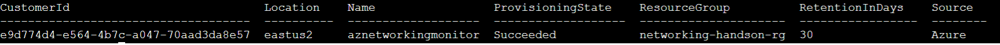
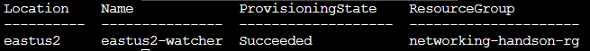

# Azure Networking hands-on lab step-by-step

## Overview

 In this hands-on lab, you will setup a virtual networks in a hub-and-spoke design. You will also learn how to secure virtual networks by implementing Azure Firewall, network security groups and application security groups, as well as configure route tables on the subnets in your virtual network. Additionally, you will set up access to the virtual network via a jump box and provision a site-to-site VPN connection from another virtual network, providing emulation of hybrid connectivity from an on-premises environment.

At the end of this hands-on lab, you will be better able to configure Azure networking components and you will be learning:

- How to bypass system routing to accomplish custom routing scenarios.

- How to setup and configure a virtual network and subnets on Azure

- How to capitalize on load balancers to distribute load and ensure service availability.

- How to implement Azure Firewall to control hybrid and cross-virtual network traffic flow based on policies.

- How to implement a combination of Network Security Groups (NSGs) and Application Security Groups (ASGs) to control traffic flow within virtual networks.

- How to monitor network traffic for proper route configuration and troubleshooting.

## Network Architecture


## Requirements

- Valid the Azure subscription account. If you don’t have one, you can create your free azure account (https://azure.microsoft.com/en-us/free/).

## Exercise 1: Create a virtual network and provision subnets

Duration: 20 minutes

### Task 1: Create a Virtual Network and Configure Subnets

**Reference:**</br>
Virtual Network documentation</br>
<https://azure.microsoft.com/en-us/documentation/services/virtual-network/>  


> **More Information:** https://docs.microsoft.com/en-us/azure/virtual-network/quick-create-portal

#### Create a virtual network using the Azure Cloud Shell. (*Bash*)

> **More Information:** https://docs.microsoft.com/en-us/azure/virtual-network/quick-create-portal

1. To start Azure Cloud Shell:

- Select the Cloud Shell button on the menu bar at the upper right in the Azure portal. ->

    

2. Wait the windows apear and enter into the prompt with the following information:

```Azure CLI
** Virtual Network - HUB **
az group create --name networking-handson-rg --location eastus2
az network vnet create --resource-group networking-handson-rg --name hubvnet --location eastus2 --address-prefixes 10.0.0.0/16 --subnet-name GatewaySubnet --subnet-prefix 10.0.1.0/27
az network vnet subnet create --address-prefix 10.0.2.0/24 --name websubnet --resource-group networking-handson-rg --vnet-name hubvnet
az network vnet subnet create --address-prefix 10.0.8.0/26 --name AzureFirewallSubnet --resource-group networking-handson-rg --vnet-name hubvnet
```

```Azure CLI
** Virtual Network - SPOKE **
az network vnet create --resource-group networking-handson-rg --name spokevnet --location eastus2 --address-prefixes 10.1.0.0/16 --subnet-name spokesubnet --subnet-prefix 10.1.1.0/24
```

```Azure CLI
** Virtual Network - On-premises **
az network vnet create --resource-group networking-handson-rg --name onpremvnet --location eastus2 --address-prefixes 192.168.0.0/16 --subnet-name onpremSubnet --subnet-prefix 192.168.1.0/24
```

3. Validate if **Virtual Networks** is create, with following command:

```Azure CLI
az network vnet list -g networking-handson-rg --output table
```
Now you built the Azure network enviroments: On-premises, Hub and Spoke on Azure.


## Exercise 2: Create a Virtual Machine

Duration: 20 minutes

### Task 1: Create the Virtual Machines

**Reference:**</br>
Virtual Machines Documentation</br>
<https://docs.microsoft.com/en-us/azure/virtual-machines/>  

#### Create a virtual machine using the Azure Cloud Shell. (*Bash*)

> **More Information:** https://docs.microsoft.com/en-us/azure/virtual-machines/windows/quick-create-cli

> **Note:** In this step you wil create 4 machines: 2 VMs for hubvnet, 1 VM for spokevnet and 1 VM for onpremisesvnet.

1. To start Azure Cloud Shell:

- Select the Cloud Shell button on the menu bar at the upper right in the Azure portal. ->

    


2. Wait the windows apear and enter into the prompt with the following information:


```Azure CLI
** Virtual Machine - Hub **
az vm availability-set create -n azhubwsserver-avset -g networking-handson-rg --platform-fault-domain-count 2 --platform-update-domain-count 2
az network nic create --resource-group networking-handson-rg -n azhubwsserver1-nic --location eastus2 --subnet websubnet --vnet-name hubvnet --private-ip-address 10.0.2.4
az vm create -n azhubwsserver1 -g networking-handson-rg --image win2016datacenter --storage-sku Standard_LRS --admin-username azureuser --admin-password Msft@123456@ --nics azhubwsserver1-nic --availability-set azhubwsserver-avset --no-wait
az vm extension set --publisher Microsoft.Compute --version 1.8 --name CustomScriptExtension --vm-name azhubwsserver1 -g networking-handson-rg --settings '{"fileUris":["https://aznetworkinghandson.blob.core.windows.net/public/deploy-iis.ps1"],"commandToExecute":"powershell.exe -ExecutionPolicy Unrestricted -file deploy-iis.ps1"}'

az network nic create --resource-group networking-handson-rg -n azhubwsserver2-nic --location eastus2 --subnet websubnet --vnet-name hubvnet --private-ip-address 10.0.2.5
az vm create -n azhubwsserver2 -g networking-handson-rg --image win2016datacenter --storage-sku Standard_LRS --admin-username azureuser --admin-password Msft@123456@ --nics azhubwsserver2-nic --availability-set azhubwsserver-avset --no-wait
az vm extension set --publisher Microsoft.Compute --version 1.8 --name CustomScriptExtension --vm-name azhubwsserver2 -g networking-handson-rg --settings '{"fileUris":["https://aznetworkinghandson.blob.core.windows.net/public/deploy-iis.ps1"],"commandToExecute":"powershell.exe -ExecutionPolicy Unrestricted -file deploy-iis.ps1"}'
```

```Azure CLI
** Virtual Machine - Spoke **
az network nic create --resource-group networking-handson-rg -n azspokeserver1-nic --location eastus2 --subnet spokesubnet --vnet-name spokevnet --private-ip-address 10.1.1.4
az vm create -n azspokeserver1 -g networking-handson-rg --image win2016datacenter --size Standard_B2s --storage-sku Standard_LRS --admin-username azureuser --admin-password Msft@123456@ --nics azspokeserver1-nic --no-wait
```

```Azure CLI
** Virtual Machine - On-premises **
az network nic create --resource-group networking-handson-rg -n onpremserver1-nic --location eastus2 --subnet onpremSubnet --vnet-name onpremvnet --private-ip-address 192.168.1.4
az vm create -n onpremserver1 -g networking-handson-rg --image win2016datacenter --size Standard_B2s --storage-sku Standard_LRS --admin-username azureuser --admin-password Msft@123456@ --nics onpremserver1-nic --no-wait
```

3. Validate if **Virtual Machines** is create, with following command:

``` Azure CLI
az monitor log-analytics workspace list -g networking-handson-rg 
```



## Exercise 3: Create a Network Monitoring Solution

Duration: 15 minutes

### Task 1: Create a Log Analytics Workspace

**Reference:**</br>
Azure Monitor documentation</br>
<https://docs.microsoft.com/en-us/azure/azure-monitor/></br>
What is Azure Network Watcher?</br>
<https://docs.microsoft.com/en-us/azure/network-watcher/network-watcher-monitoring-overview>


#### Create a Log Analytics and Network Watcher using the Azure Cloud Shell.(*Bash*)

> **More Information:** https://docs.microsoft.com/en-us/azure/virtual-machines/windows/quick-create-cli

1. To start Azure Cloud Shell:

- Select the Cloud Shell button on the menu bar at the upper right in the Azure portal. ->

    


2. Wait the windows apear and enter into the prompt with the following information:

``` Azure CLI
az group deployment create --resource-group networking-handson-rg --name azurenetworkinghandson-deploy --template-uri https://aznetworkinghandson.blob.core.windows.net/public/azmonitor.json
```
3. Validate if **Log Analytics** is create, with following command:

``` Azure CLI
az monitor log-analytics workspace list -g networking-handson-rg 
```


### Task 2: Configure Network Watcher

1. To start Azure Cloud Shell and enter with the following information:

``` Azure CLI
az network watcher configure -g networking-handson-rg  -l eastus2 --enabled true
```
3. Validate if **Network Watcher** is create, with following command:

``` Azure CLI
az network watcher list --output table
```



## Exercise 4: Configure Network Security Groups and Application Security Groups

In this exercise, you will restrict traffic between tiers of n-tier application by using network security groups and application security groups.

Duration: 15 minutes

**Reference:**</br>
Azure Network Security Groups</br>
<https://docs.microsoft.com/en-us/azure/virtual-network/security-overview></br>


### Task 1: Create a network security group

#### Create a Network Security Groups using the Azure Cloud Shell.(*Bash*)

> **More Information:** https://docs.microsoft.com/en-us/azure/virtual-machines/windows/quick-create-cli

1. To start Azure Cloud Shell:

- Select the Cloud Shell button on the menu bar at the upper right in the Azure portal. ->

    


2. Wait the windows apear and enter into the prompt with the following information:

``` Azure CLI
** Virtual Machine - Azure Bastion **
az network nsg create -g networking-handson-rg --name nsg_azurebastion
az network nsg rule create --name bastion-in-allow --nsg-name nsg_azurebastion --priority 100 -g networking-handson-rg --access Allow --protocol Tcp --direction Inbound --destination-port-ranges 443
az network nsg rule create --name bastion-control-in-allow --nsg-name nsg_azurebastion --priority 120 -g networking-handson-rg --access Allow --protocol Tcp --direction Inbound --destination-port-ranges 443 4443 --source-address-prefixes GatewayManager
az network nsg rule create --name bastion-in-deny --nsg-name nsg_azurebastion --priority 900 -g networking-handson-rg --access Deny --protocol Tcp --direction Inbound
az network nsg rule create --name bastion-vnet-out-allow --nsg-name nsg_azurebastion --priority 100 -g networking-handson-rg --access Allow --protocol Tcp --direction Outbound --destination-port-ranges 22 3389 --destination-address-prefixes VirtualNetwork
az network nsg rule create --name bastion-azure-out-allow --nsg-name nsg_azurebastion --priority 120 -g networking-handson-rg --access Allow --protocol Tcp --direction Outbound --destination-port-ranges 443 --destination-address-prefixes AzureCloud
```

``` Azure CLI
** Virtual Machine - Management Subnet **
az network nsg create -g networking-handson-rg --name nsg_managment
az network nsg rule create --name managment-in-allow_ssh_rdp --nsg-name nsg_managment --priority 100 -g networking-handson-rg --access Allow --protocol Tcp --direction Inbound --destination-port-ranges 22 3389 --source-address-prefixes VirtualNetwork
az network nsg rule create --name managment-in-allow_icmp --nsg-name nsg_managment --priority 120 -g networking-handson-rg --access Allow --protocol Icmp --direction Inbound --source-address-prefixes VirtualNetwork
az network vnet subnet update -g networking-handson-rg -n spokesubnet --vnet-name spokevnet --network-security-group nsg_managment
```

``` Azure CLI
** Virtual Machine - Web Subnet **
az network nsg create -g networking-handson-rg --name nsg_web
az network nsg rule create --name web-in-allow_ssh_rdp --nsg-name nsg_web --priority 100 -g networking-handson-rg --access Allow --protocol Tcp --direction Inbound --destination-port-ranges 22 3389 --destination-address-prefixes VirtualNetwork
az network nsg rule create --name web-in-allow_https_http --nsg-name nsg_web --priority 120 -g networking-handson-rg --access Allow --protocol Tcp --direction Inbound --destination-port-ranges 443 80 --destination-address-prefixes VirtualNetwork
az network nsg rule create --name web-in-allow_icmp --nsg-name nsg_web --priority 130 -g networking-handson-rg --access Allow --protocol Icmp --direction Inbound --source-address-prefixes VirtualNetwork
az network vnet subnet update -g networking-handson-rg -n websubnet --vnet-name hubvnet --network-security-group nsg_web
```

3. Validate if **Network Security Group** is create, with following command:

``` Azure CLI
az network nsg list --output table
```


## Exercise 4: Configure Azure Bastion Host

Duration: 20 minutes

**Reference:**</br>
Azure Bastion documentation</br>
<https://docs.microsoft.com/en-us/azure/bastion/></br>


### Task 1: Create Azure Bastion Host

#### Create a Azure Bastion Hosts using the Azure Cloud Shell. (*Porwershell*)

> **More Information:** https://docs.microsoft.com/en-us/azure/virtual-machines/windows/quick-create-cli

1. To start Azure Cloud Shell:

- Select the Cloud Shell button on the menu bar at the upper right in the Azure portal. ->

    


2. Wait the windows apear and enter into the prompt with the following information:

## After the hands-on lab

Duration: 10 minutes

After you have successfully completed the Enterprise-class networking in Azure hands-on lab step-by-step, you will want to delete the Resource Groups. This will free up your subscription from future charges.

You should follow all steps provided *after* attending the Hands-on lab.
