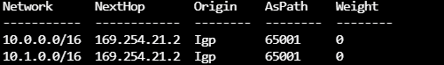

# Azure Labs (Networking) - Azure Route Server - Enable Transit Between ExpressRoute and Azure VPN Gateway
## Introduction

This article describes how to build an environment to enable the transit between ExpressRoute and Azure VPN Gateway using the Azure Route Server. For allowing the [Azure ExpressRoute connection](https://docs.microsoft.com/en-us/azure/expressroute/expressroute-introduction), and simulate traffic of that, you will use another cloud provider (AWS) to establish the relationship through the [Equinix Network Edge](https://www.equinix.com/services/edge-services/network-edge/) and [DirectConnect](https://aws.amazon.com/directconnect/). The On-premises data center is connected to Azure by IPSec VPN.  

There is includes billable components of Equinix. You can also [check out the Equinix Network Edge trial](https://edgeservices.equinix.com/products?p_p_id=catalogportlet_WAR_emergingservicesportlets&p_p_lifecycle=0&p_p_state=normal&p_p_mode=view&_catalogportlet_WAR_emergingservicesportlets_productId=2c92a0ff68bf6b420168d0faa31b08c2&_catalogportlet_WAR_emergingservicesportlets_action=product/details) that has the features that are required to complete this lab.

> Choose the regions in the cloud providers near the Equinix Cloud Exchange (ECX). 

 [ExpressRoute partners and peering locations](https://docs.microsoft.com/en-us/azure/expressroute/expressroute-locations-providers)</br>
 [AWS Direct Connect Locations](https://aws.amazon.com/directconnect/locations/)

The following diagram shows the architecture that you create in this article:


 All Azure configs are done in Azure CLI and AWS CLI and, you can change them as needed to match your environment. 

 **References:**</br>
 [What is Azure Route Server](https://docs.microsoft.com/en-us/azure/route-server/overview)</br>
 [Azure Route Server: super powers for your Network Virtual Appliance](https://blog.cloudtrooper.net/2021/03/03/azure-route-server-super-powers-for-your-network-virtual-appliance/)
 

## Prerequisites

- Install the Az CLI [Install the Azure CLI](https://docs.microsoft.com/pt-br/cli/azure/install-azure-cli) or use the [Azure Cloud Shell](https://docs.microsoft.com/en-us/azure/cloud-shell/overview) to run it.
- Install the AWS CLI [Install the AWS CLI](https://docs.aws.amazon.com/cli/latest/userguide/cli-chap-install.html) or use the [AWS CloudShell](https://docs.aws.amazon.com/cloudshell/latest/userguide/welcome.html) to run it.
- Ensure you are properly logged in AWS Account, check out [How IAM users sign in to your AWS account](https://docs.aws.amazon.com/IAM/latest/UserGuide/getting-started_how-users-sign-in.html)
- Ensure you are properly logged in to your tenant and with a subscription selected for Azure. You can check that by using:

```azure cli
az account list --output table
az account set --subscription "My Subscription"
```
## Lab

Create the Lab environment using the Azure CLI on Azure Cloud Shell for Azure resources.

1. To start Azure Cloud Shell:

    - Select the Cloud Shell button on the menu bar at the upper right in the Azure portal. ->

    

2. Wait for the windows appear and enter into the prompt with the following information:

```azure cli
** Virtual Network - HUB **
location='eastus2'
rg='lab-aws-vpn-to-azurevpngw-ikev2-bgp-rg'
az group create --name $rg --location $location
az network vnet create --resource-group $rg --name az-hub-vnet --location $location --address-prefixes 10.0.0.0/16 --subnet-name GatewaySubnet --subnet-prefix 10.0.1.0/27
```

```azure cli
** Virtual Network - SPOKE **
az network vnet create --resource-group $rg --name az-spoke-vnet --location $location --address-prefixes 10.1.0.0/16 --subnet-name vmsubnet --subnet-prefix 10.1.1.0/24
```

``` azure cli
** vNET Peerings -  **
hubvNet1Id=$(az network vnet show --resource-group $rg --name az-hub-vnet --query id --out tsv)
spokevNet1Id=$(az network vnet show --resource-group $rg --name az-spoke-vnet --query id --out tsv)
az network vnet peering create --name to-spokevnet --resource-group $rg --vnet-name az-hub-vnet --remote-vnet $spokevNet1Id --allow-vnet-access 
az network vnet peering create --name to-hubvnet --resource-group $rg --vnet-name az-spoke-vnet --remote-vnet $hubvNet1Id --allow-vnet-access 
```

```azure cli
** VPN Gateway and Update vNET Peerings  **
az network public-ip create --name azure-vpngw-pip --resource-group $rg --allocation-method Dynamic
az network vnet-gateway create --name azure-vpngw --public-ip-address azure-vpngw-pip --resource-group $rg --vnet az-hub-vnet --gateway-type Vpn --vpn-type RouteBased --sku VpnGw1 --asn 65001 --no-wait
az network vnet peering update -g $rg -n to-spokevnet --vnet-name az-hub-vnet --set allowGatewayTransit=true
az network vnet peering update -g $rg -n to-hubvnet --vnet-name az-spoke-vnet --set useRemoteGateways=true --set allowForwardedTraffic=true
```
```azure cli
** Virtual Machine  **
az network public-ip create --name azlinuxvm01-pip --resource-group $rg --location $location --allocation-method Dynamic
az network nic create --resource-group $rg -n azlinuxvm01-nic --location $location --subnet vmsubnet --private-ip-address 10.1.1.10 --vnet-name az-spoke-vnet --public-ip-address azlinuxvm01-pip --ip-forwarding true
az vm create -n azlinuxvm01 -g $rg --image UbuntuLTS --admin-username azureuser --admin-password Msft123Msft123 --nics azlinuxvm01-nic --no-wait
```
Build the AWS resources using the AWS CLI.

1. To start AWS CloudShell:

    - Select the Cloud Shell button on the menu bar at the upper in the AWS portal. ->
    

2. Wait for the windows appear and enter into the prompt with the following information:

```aws cli
** Variables, VPC and Subnets  **
AWS_REGION="us-east-1"
VPC_NAME="vpc-us-aws"
VPC_CIDR="10.2.0.0/16"
SUBNET_PRIVATE_NAME="ec2subnet"
SUBNET_PRIVATE_CIDR="10.2.1.0/24"
ROUTE_TABLE_NAME="rt-ec2subnet"'
EC2_NAME="awslinuxvm01"
VPC_ID=$(aws ec2 create-vpc --cidr-block $VPC_CIDR --query 'Vpc.{VpcId:VpcId}' --output text --region $AWS_REGION)
aws ec2 create-tags --resources $VPC_ID --tags "Key=Name,Value=$VPC_NAME" --region $AWS_REGION
SUBNET_PRIVATE_ID=$(aws ec2 create-subnet --vpc-id $VPC_ID --cidr-block $SUBNET_PRIVATE_CIDR --query 'Subnet.{SubnetId:SubnetId}' --output text --region $AWS_REGION)
aws ec2 create-tags --resources $SUBNET_PRIVATE_ID --tags "Key=Name,Value=$SUBNET_PRIVATE_NAME" --region $AWS_REGION
```

```aws cli
** IGW,  Route Table **
IGW_ID=$(aws ec2 create-internet-gateway --query 'InternetGateway.{InternetGatewayId:InternetGatewayId}' --output text --region $AWS_REGION)
aws ec2 attach-internet-gateway --vpc-id $VPC_ID --internet-gateway-id $IGW_ID --region $AWS_REGION
ROUTE_TABLE_ID=$(aws ec2 create-route-table --vpc-id $VPC_ID --query 'RouteTable.{RouteTableId:RouteTableId}' --output text --region $AWS_REGION)
aws ec2 create-tags --resources $ROUTE_TABLE_ID --tags "Key=Name,Value=$ROUTE_TABLE_NAME" --region $AWS_REGION
RESULT=$(aws ec2 create-route --route-table-id $ROUTE_TABLE_ID --destination-cidr-block 0.0.0.0/0 --gateway-id $IGW_ID --region $AWS_REGION)
RESULT=$(aws ec2 associate-route-table --subnet-id $SUBNET_PRIVATE_ID --route-table-id $ROUTE_TABLE_ID --region $AWS_REGION)
aws ec2 modify-subnet-attribute --subnet-id $SUBNET_PRIVATE_ID --map-public-ip-on-launch --region $AWS_REGION
```

```aws cli
** EC2, Security Group amd Key Pair **
aws ec2 create-security-group --group-name sg_ec2 --description "Lab - Azure VPN Gateway to AWS VGW with IKEv2 and BGP" --vpc-id $VPC_ID
SG_ID=$(aws ec2 describe-security-groups --filters Name=group-name,Values=sg_ec2 --query "SecurityGroups[*].{GroupId:GroupId}" --output text --region $AWS_REGION)
aws ec2 authorize-security-group-ingress --group-id $SG_ID --protocol tcp --port 22 --cidr 0.0.0.0/0
aws ec2 create-key-pair --key-name aws-key-ec2 --query 'KeyMaterial' --output text > aws-key-ec2.pem
aws ec2 run-instances --image-id ami-0885b1f6bd170450c --security-group-ids $SG_ID --instance-type t2.micro --key-name aws-key-ec2 --private-ip-address 10.2.1.10 --subnet-id $SUBNET_PRIVATE_ID
EC2_ID=$(aws ec2 describe-instances --filters Name=network-interface.addresses.private-ip-address,Values=10.2.1.10 --query 'Reservations[*].Instances[*].{Instance:InstanceId}' --output text --region $AWS_REGION)
aws ec2 create-tags --resources $EC2_ID --tags "Key=Name,Value=$EC2_NAME" --region $AWS_REGION
```

```aws cli
** Customer Gateway, VPW and VNC**
aws ec2 create-customer-gateway --type ipsec.1 --public-ip <Azure VPN GW - Public IP Address> --bgp-asn 65001
CGW_ID=$(aws ec2 describe-customer-gateways --filters Name=bgp-asn,Values=65001 --query 'CustomerGateways[*].{CustomerGatewayId:CustomerGatewayId}' --output text --region $AWS_REGION)
aws ec2 create-vpn-gateway --type ipsec.1 --amazon-side-asn 65002
VGW_ID=$(aws ec2 describe-vpn-gateways --filters Name=amazon-side-asn,Values=65002 --query 'VpnGateways[*].{VpnGatewayId:VpnGatewayId}' --output text --region $AWS_REGION)
aws ec2 attach-vpn-gateway --vpn-gateway-id $VGW_ID --vpc-id $VPC_ID
aws ec2 create-vpn-connection --type ipsec.1 --customer-gateway-id $CGW_ID --vpn-gateway-id $VGW_ID --options TunnelOptions='[{TunnelInsideCidr=169.254.21.0/30,PreSharedKey=Msft123Msft123},{TunnelInsideCidr=169.254.21.10/30,PreSharedKey=Msft123Msft123}]'
```

```aws cli
aws ec2 enable-vgw-route-propagation --route-table-id $ROUTE_TABLE_ID --gateway-id $VGW_ID 
```

Configure the APIPA IP address space on Azure VPN Gateway to connect with AWS VGW.

1.  In Azure, add the IP address "169.254.21.2" inside VPN Gateway ("azure-vpngw") and save the configuration.


Create Local Network Gateway and enter the "AWSVPNPublicIP" public IP. AWS BGP peer over IPSEC is in ASN 65002.

```azure cli
location='eastus2'
rg='lab-aws-vpn-to-azurevpngw-ikev2-bgp-rg'
az network local-gateway create --gateway-ip-address "AWSVPNPublicIP" --name to-aws --resource-group $rg --asn 65002 --local-address-prefixes 169.254.21.1/32 --bgp-peering-address 169.254.21.1
az network vpn-connection create --name to-aws --resource-group $rg --vnet-gateway1 azure-vpngw --location $location --shared-key Msft123Msft123 --local-gateway2 to-onprem --enable-bgp
```
After you finish to create the environment, you need to check the Azure connection configuration.

Validate VPN connection status in Azure CLI

```azure cli
az network vpn-connection show --name to-aws --resource-group $rg
```

Validate the BGP routes being advertised from the Azure VPN GW to the AWS.

```azure cli
az network vnet-gateway list-advertised-routes -g $rg -n azure-vpngw --peer 169.254.21.1 -o table
```


Validate the BGP routes the Azure VPN GW is receiving from the AWS.

```azure cli
az network vnet-gateway list-learned-routes -g $rg -n azure-vpngw -o table
```


You can test the connectivity between Azure and AWS, trying to reach the Azure virtual machine from EC2 using the ping command: **ping 10.1.1.10**
## Clean All Resources after the lab

After you have successfully completed the lab, you will want to delete the Resource Groups. Run the following command on Azure Cloud Shell:

``` Azure CLI
## Azure Resources
az group delete --name $rg --location $location
```
For AWS resources check out the articles:

 **References:**</br>
 [How do I delete or terminate my Amazon EC2 resources?](https://aws.amazon.com/premiumsupport/knowledge-center/delete-terminate-ec2/)</br>
 [Deleting a Site-to-Site VPN connection](https://docs.aws.amazon.com/vpn/latest/s2svpn/delete-vpn.html)</br>
 [delete-vpc](https://docs.aws.amazon.com/cli/latest/reference/ec2/delete-vpc.html)

## Contributing
Pull requests are welcome. For major changes. Please make sure to update tests as appropriate.
