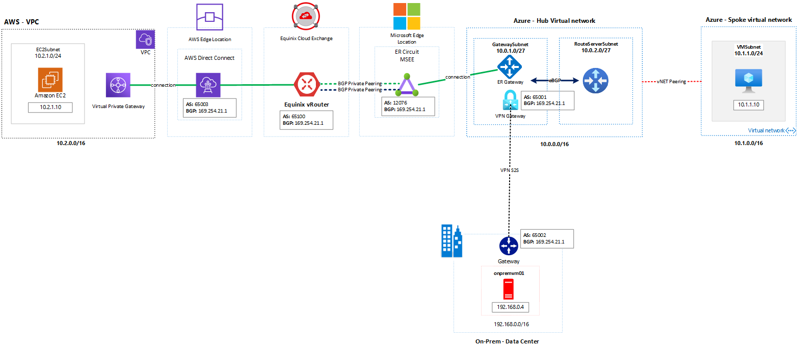
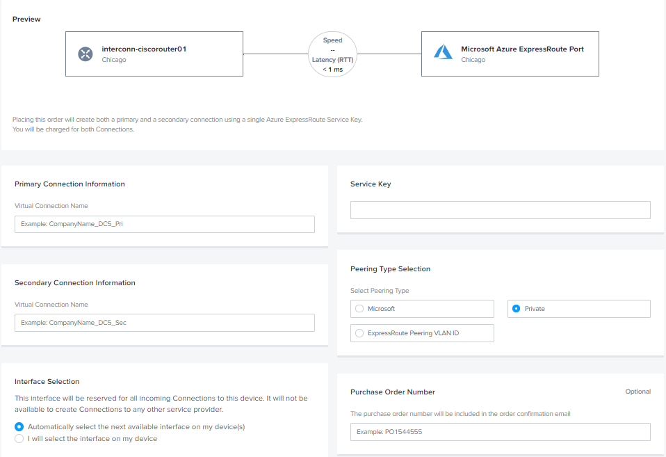
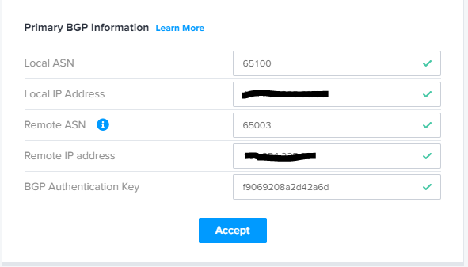

# Azure Labs (Networking) - Azure Route Server - Enable Transit Between ExpressRoute and Azure VPN Gateway
## Introduction

This article describes how to build an environment to enable the transit between ExpressRoute and Azure VPN Gateway using the Azure Route Server. To allow the [Azure ExpressRoute connection](https://docs.microsoft.com/en-us/azure/expressroute/expressroute-introduction), and simulate traffic of that, you will use another cloud provider (AWS) to establish the relationship through the [Equinix Network Edge](https://www.equinix.com/services/edge-services/network-edge/) and [DirectConnect](https://aws.amazon.com/directconnect/). The On-premises data center is connected to Azure by IPSec VPN.  

There is includes billable components of Equinix. You can also [check out the Equinix Network Edge trial](https://edgeservices.equinix.com/products?p_p_id=catalogportlet_WAR_emergingservicesportlets&p_p_lifecycle=0&p_p_state=normal&p_p_mode=view&_catalogportlet_WAR_emergingservicesportlets_productId=2c92a0ff68bf6b420168d0faa31b08c2&_catalogportlet_WAR_emergingservicesportlets_action=product/details) that has the features that are required to complete this lab.

> Choose the regions in the cloud providers near the Equinix Cloud Exchange (ECX). 

 [ExpressRoute partners and peering locations](https://docs.microsoft.com/en-us/azure/expressroute/expressroute-locations-providers)</br>
 [AWS Direct Connect Locations](https://aws.amazon.com/directconnect/locations/)

The following diagram shows the architecture that you create in this article:




 All Azure and AWS configs are done in Azure CLI or AWS CLI, and you can change them as needed to match your environment. 

 **References:**</br>
 [What is Azure Route Server](https://docs.microsoft.com/en-us/azure/route-server/overview)</br>
 [Azure Route Server: super powers for your Network Virtual Appliance](https://blog.cloudtrooper.net/2021/03/03/azure-route-server-super-powers-for-your-network-virtual-appliance/)</br>
 [How Network Edge Virtualization for Network Services Takes You Beyond the Data Center](https://blog.equinix.com/blog/2019/11/13/how-network-edge-virtualization-for-network-services-takes-you-beyond-the-data-center/)
 

 :warning: Azure Route Server (Preview) is currently in public preview.
## Prerequisites

- Install the Az CLI [Install the Azure CLI](https://docs.microsoft.com/pt-br/cli/azure/install-azure-cli) or use the [Azure Cloud Shell](https://docs.microsoft.com/en-us/azure/cloud-shell/overview) to run it.
- Install the AWS CLI [Install the AWS CLI](https://docs.aws.amazon.com/cli/latest/userguide/cli-chap-install.html) or use the [AWS CloudShell](https://docs.aws.amazon.com/cloudshell/latest/userguide/welcome.html) to run it.
- Ensure you are properly logged in AWS Account, check out [How IAM users sign in to your AWS account](https://docs.aws.amazon.com/IAM/latest/UserGuide/getting-started_how-users-sign-in.html)
- Ensure you are properly logged in to your tenant and with a subscription selected for Azure. You can check that by using:

```azure cli
az account list --output table
az account set --subscription "My Subscription"
```
## Lab
### Azure
Create the Lab environment using the Azure CLI on Azure Cloud Shell for Azure resources.

1. To start Azure Cloud Shell:

    - Select the Cloud Shell button on the menu bar at the upper right in the Azure portal. ->

    

2. Wait for the windows appear and enter into the prompt with the following information:

```azure cli
** Virtual Network - HUB **
location='northcentralus'
rg='enable-transit-routeserver'
er_location='Chicago'
az group create --name $rg --location $location
az network vnet create --resource-group $rg --name az-hub-vnet --location $location --address-prefixes 10.0.0.0/16 --subnet-name GatewaySubnet --subnet-prefix 10.0.1.0/24
az network vnet subnet create -g $rg --vnet-name "az-hub-vnet" --name "RouteServerSubnet" --address-prefix "10.0.2.0/24"
```

```azure cli
** Virtual Network - SPOKE **
az network vnet create --resource-group $rg --name az-spoke-vnet --location $location --address-prefixes 10.1.0.0/16 --subnet-name vmsubnet --subnet-prefix 10.1.1.0/24
```

```azure cli
** Virtual Network - ONPREM **
az network vnet create --resource-group $rg --name onprem-vnet --location $location --address-prefixes 192.168.0.0/16 --subnet-name vmsubnet --subnet-prefix 192.168.0.0/24
az network vnet subnet create --address-prefix 192.168.1.0/24 --name outsidesubnet --resource-group $rg --vnet-name onprem-vnet
az network vnet subnet create --address-prefix 192.168.2.0/24 --name insidesubnet --resource-group $rg --vnet-name onprem-vnet
```

``` azure cli
** vNET Peerings -  **
hubvNet1Id=$(az network vnet show --resource-group $rg --name az-hub-vnet --query id --out tsv)
spokevNet1Id=$(az network vnet show --resource-group $rg --name az-spoke-vnet --query id --out tsv)
az network vnet peering create --name to-spokevnet --resource-group $rg --vnet-name az-hub-vnet --remote-vnet $spokevNet1Id --allow-vnet-access 
az network vnet peering create --name to-hubvnet --resource-group $rg --vnet-name az-spoke-vnet --remote-vnet $hubvNet1Id --allow-vnet-access 
```

```azure cli
** VPN Gateway, ER GW, ER Circuit and Update vNET Peerings  **
az network public-ip create --name azure-vpngw01-pip --resource-group $rg --allocation-method Dynamic
az network public-ip create --name azure-vpngw02-pip --resource-group $rg --allocation-method Dynamic
az network public-ip create --name azure-ergw-pip --resource-group $rg --allocation-method Dynamic
az network vnet-gateway create --name azure-vpngw --public-ip-address azure-vpngw01-pip azure-vpngw02-pip --resource-group $rg --vnet az-hub-vnet --gateway-type Vpn --vpn-type RouteBased --sku VpnGw1 -l $location --asn 65001 --no-wait
az network vnet-gateway create -g $rg -n azure-ergw --gateway-type ExpressRoute --sku Standard -l $location --vnet az-hub-vnet --public-ip-addresses azure-ergw-pip --no-wait
az network express-route create -n ercircuit-equinix-chicago --peering-location $er_location -g $rg --bandwidth 50 --provider Equinix -l $location --sku-family MeteredData --sku-tier Standard
az network vnet peering update -g $rg -n to-spokevnet --vnet-name az-hub-vnet --set allowGatewayTransit=true
az network vnet peering update -g $rg -n to-hubvnet --vnet-name az-spoke-vnet --set useRemoteGateways=true --set allowForwardedTraffic=true
```

> For ExpressRoute and Site-to-Site VPN connections to coexist, you need to keep the AS value 65515 for Azure VPN Gateway.</br>
> [Configure ExpressRoute and Site-to-Site coexisting connections using PowerShell](https://docs.microsoft.com/en-us/azure/expressroute/expressroute-howto-coexist-resource-manager)

```azure cli
** Azure Route Server**
$subnet_id=$(az network vnet subnet show -n "RouteServerSubnet" --vnet-name "az-hub-vnet" -g $rg --query id -o tsv)
az network routeserver create -n "az-routeserver" -g $rg --hosted-subnet $subnet_id
az network routeserver update -g $rs -n "az-routeserver" --allow-b2b-traffic true
```

```azure cli
** Virtual Machines  **
az network public-ip create --name azlinuxvm01-pip --resource-group $rg --location $location --allocation-method Dynamic
az network nic create --resource-group $rg -n azlinuxvm01-nic --location $location --subnet vmsubnet --private-ip-address 10.1.1.10 --vnet-name az-spoke-vnet --public-ip-address azlinuxvm01-pip --ip-forwarding true
az vm create -n azlinuxvm01 -g $rg --image UbuntuLTS --admin-username azureuser --admin-password Msft123Msft123 --nics azlinuxvm01-nic --no-wait
az network public-ip create --name onpremlinuxvm01-pip --resource-group $rg --location $location --allocation-method Dynamic
az network nic create --resource-group $rg -n onpremlinuxvm01-nic --location $location --subnet vmsubnet --private-ip-address 192.168.0.10 --vnet-name onprem-vnet --public-ip-address onpremlinuxvm01-pip 
az vm create -n onpremlinuxvm01 -g $rg --image UbuntuLTS --admin-username azureuser --location $location --admin-password Msft123Msft123 --nics onpremlinuxvm01-nic --no-wait
```

```azure cli
** Cisco CSR - ONPREM - VPN  **
az network public-ip create --name onpremcsrvm01-pip --resource-group $rg --idle-timeout 30 --allocation-method Static
az network nic create --name onpremcsroutside-nic -g $rg --subnet outsidesubnet --private-ip-address 192.168.1.4 --vnet onprem-vnet --public-ip-address onpremcsrvm01-pip --ip-forwarding true
az network nic create --name onpremcsrinside-nic  -g $rg --subnet insidesidesubnet --private-ip-address 192.168.2.4  --vnet onprem-vnet --ip-forwarding true
az vm create --resource-group $rg --name onpremcsrvm01 --size Standard_DS3_v2 --nics onpremcsroutside-nic onpremcsrinside-nic  --image cisco:cisco-csr-1000v:17_2_1-byol:17.2.120200508 --admin-username azureuser --admin-password Msft123Msft123 --no-wait
```

After the gateway and CSR have been created, document the public IP address, BGP peer, and ASN for both. 

```azure cli
az network vnet-gateway list --query [].[name,bgpSettings.asn,bgpSettings.bgpPeeringAddress] -o table --resource-group $rg
az network public-ip show -g $rg -n <Azure-VNGpubip1> --query "{address: ipAddress}"
az network public-ip show -g $rg -n <Azure-VNGpubip2> --query "{address: ipAddress}"
az network public-ip show -g $rg -n <CSR1PublicIP> --query "{address: ipAddress}"
```

Create Local Network Gateway and Connection. The 172.16.1.1 address is the IP of the loopback interface on the Cisco CSR in BGP ASN 65002.

```azure cli
az network local-gateway create --gateway-ip-address "insert Cisco CSR Public IP" --name to-onprem --resource-group $rg --local-address-prefixes 172.16.1.1/32 --asn 65002 --bgp-peering-address 172.16.1.1
az network vpn-connection create --name to-onprem --resource-group $rg --vnet-gateway1 azure-vpngw -l $location --shared-key Msft123Msft123 --local-gateway2 to-onprem --enable-bgp
```

Connect via SSH to the Cisco CSR and paste in the below config. Make sure to change "Azure-VNGpubip1" and "Azure-VNGpubip2". 

<pre lang="...">
ip route 192.168.0.0 255.255.255.0 10.1.1.1

crypto ikev2 proposal Azure-Ikev2-Proposal 
 encryption aes-cbc-256
 integrity sha1
 group 2
!
crypto ikev2 policy Azure-Ikev2-Policy 
 match address local 192.168.1.4
 proposal Azure-Ikev2-Proposal
!         
crypto ikev2 keyring to-onprem-keyring
 peer <Azure-VNGpubip1>
  address <Azure-VNGpubip1>
  pre-shared-key Msft123Msft123
 !
 peer <Azure-VNGpubip2>
  address <Azure-VNGpubip2>
  pre-shared-key Msft123Msft123
 !
crypto ikev2 profile Azure-Ikev2-Profile
 match address local 10.1.0.4
 match identity remote address <Azure-VNGpubip1> 255.255.255.255 
 match identity remote address <Azure-VNGpubip2> 255.255.255.255 
 authentication remote pre-share
 authentication local pre-share
 keyring local to-onprem-keyring
 lifetime 3600
 dpd 10 5 on-demand

crypto ipsec transform-set to-Azure-TransformSet esp-gcm 256 
 mode tunnel
!
!
crypto ipsec profile to-Azure-IPsecProfile
 set transform-set to-Azure-TransformSet 
 set ikev2-profile Azure-Ikev2-Profile
 set security-association lifetime seconds 3600
!
interface Loopback11
 ip address 172.16.1.1 255.255.255.255
!
interface Tunnel11
 ip address 172.16.2.1 255.255.255.255
 ip tcp adjust-mss 1350
 tunnel source 192.168.1.4
 tunnel mode ipsec ipv4
 tunnel destination <Azure-VNGpubip1>
 tunnel protection ipsec profile to-Azure-IPsecProfile
!
interface Tunnel12
 ip address 172.16.3.1 255.255.255.255
 ip tcp adjust-mss 1350
 tunnel source 192.168.1.4
 tunnel mode ipsec ipv4
 tunnel destination <Azure-VNGpubip2>
 tunnel protection ipsec profile to-Azure-IPsecProfile

router bgp 65002
 bgp router-id 192.168.1.1
 bgp log-neighbor-changes
 neighbor 10.0.0.14 remote-as 65001
 neighbor 10.0.0.14 ebgp-multihop 255
 neighbor 10.0.0.14 update-source Loopback11
 neighbor 10.0.0.15 remote-as 65001
 neighbor 10.0.0.15 ebgp-multihop 255
 neighbor 10.0.0.15 update-source Loopback11
 !
 address-family ipv4
  network 192.168.0.0 mask 255.255.255.0
  neighbor 10.0.0.14 activate
  neighbor 10.0.0.15 activate
  maximum-paths 2
 exit-address-family

ip route 10.0.0.14 255.255.255.255 Tunnel11
ip route 10.0.0.15 255.255.255.255 Tunnel12
</pre>

Connect to azlinuxvm01, and try to ping the onpremlinuxvm01.
### Equinix
#### Creating an Equinix Network Edge router

1. Log in to the [Equinix Cloud Exchange portal](https://ecxfabric.equinix.com/).
2. In the **Network Edge** drop-down menu, click **Create a Virtual Device**.
3. If you use the Equinix trial account, skip this step, because you can create only a single router with the trial. Otherwise, on the Create an Edge Device page, click A Single 4.Edge Device without High Availability to create a single-device configuration.
4. Click Begin Creating Edge Device(s).
5. For your vendor device and virtual network function, select the Cisco CSR 1000V router, and then click Continue.
6. For Location, select Chicago, and then from the drop-down list, select your Equinix account. If you are using a trial account, you can skip this step.
7. Click Next: Device Details.
8. On the Device Details page, provide the following details:
    - For Device Configuration, select Equinix-Configured.
    - For Licensing, select Subscription.
    - For Device Resources, select 2 Cores, 4 GB Memory.
    - For Software Package & Version, select Security for the software package and 16.09.05 for the version.
    - For License Thoughtput, select one of the options. The minimum option (50 mbps) is sufficient for completing this lab. This value affects the license price, which is displayed after you complete the form.
    - For Virtual Device Details, enter a device name and a host name prefix.
    - For Device Status Notifications, enter your email address.
    - If you're not using a trial account, choose a term length. The default is one month.

You can leave the remaining fields blank. If you're not using the free trial, you can see the price overview.


9. Click Next: Additional Services.
10. On the Additional Services page, leave the default settings, and then click Next: Review.
11. After you review the information, click Order Terms to review the terms. If you accept the terms, click Accept.
12. Click Create Edge Device.
13. Click Network Edge/View Virtual Devices.
14. Click the device name and verify that the device is in either the Initializing or Provisioning state.

Provisioning a device can take a couple of minutes. After the device is provisioned and available, you receive an email at the notification address. The status changes to Provisioned.


#### Creating an Azure connection on the Equinix Network Edge vRouter

1. In the Equinix ECX portal, click Connections and then click Create Connection.
2. Under Frequent Connections, select **Azure**
3. Click Create a Connection to Azure ExpressRoute.


4. Select the origin region and virtual device.


5. On the Connection Details page, provide the following details:
    - For Primary Connection Information, enter a name (**azure-primary-link**)
    - For Secondary Connection Information, enter a name (**azure-secondary-link**)
    - For Service Key, enter with an **Azure ExpressRoute Circuit - Service Key**



6. Check out the connection speed, and then click Next.
7. Verify the connection details and the notification email, and then click Submit your Order.
8. On the Connection Page, click on Azure Connection, get the VLAN ID to add on the Azure ExpressRoute Circuit, and configure the Primary BGP Information and Secondary BGP Information with the following picture:


After you were provision the circuit in the Equinix portal, continue the set up on the Azure Portal using the Azure CLI.

```azure cli
** ER - Configuration  **
az network express-route peering create --name "private-peering" --type "AzurePrivatePeering" --circuit-name "ercircuit-equinix-chicago" --resource-group $rg --peer-asn 65100 --primary-peer-subnet "192.168.100.128/30" --secondary-peer-subnet "192.168.100.128/30" --vlan-id <vlan_id_by_equinix> 
circuit_id=$(az network express-route show -n ercircuit-equinix-chicago -g $rg -o tsv --query id)
az network vpn-connection create -n erconnection -g $rg --vnet-gateway1 az-ergw --express-route-circuit2 $circuit_id
```
#### Creating an AWS connection on the Equinix Network Edge vRouter

1. In the Equinix ECX portal, click Connections, and then click Create Connection.
2. Under Frequent Connections, select Amazon Web Services.
3. In AWS Direct Connect, click Create Connection.
4. After reviewing the directions, click Create a Connection to Amazon Web Services.
5. Select the origin region and virtual device. If your organization manages a high number of ports and devices, scroll the list to find your selection.
6. Select Chicago, then click Next.
7. Complete the Connection Information (for your records only) and **AWS Account ID** fields. Remove any spaces or dashes when you enter the account ID, which consists of 12 numbers. For more information, see the AWS documentation about how to find your account ID.
8. Select a connection speed, then click Next.


9. Verify the connection details and the notification email, and then click Submit your Order.
### AWS

Build the AWS resources using the AWS CLI.

1. To start AWS CloudShell:

    - Select the Cloud Shell button on the menu bar at the upper in the AWS portal. ->
    

2. Wait for the windows appear and enter into the prompt with the following information:

```aws cli
** Variables, VPC and Subnets  **
AWS_REGION="us-east-2"
VPC_NAME="vpc-us-aws"
VPC_CIDR="10.2.0.0/16"
SUBNET_PRIVATE_NAME="ec2subnet"
SUBNET_PRIVATE_CIDR="10.2.1.0/24"
ROUTE_TABLE_NAME="rt-ec2subnet"
EC2_NAME="awslinuxvm01"
VPC_ID=$(aws ec2 create-vpc --cidr-block $VPC_CIDR --query 'Vpc.{VpcId:VpcId}' --output text --region $AWS_REGION)
aws ec2 create-tags --resources $VPC_ID --tags "Key=Name,Value=$VPC_NAME" --region $AWS_REGION
SUBNET_PRIVATE_ID=$(aws ec2 create-subnet --vpc-id $VPC_ID --cidr-block $SUBNET_PRIVATE_CIDR --query 'Subnet.{SubnetId:SubnetId}' --output text --region $AWS_REGION)
aws ec2 create-tags --resources $SUBNET_PRIVATE_ID --tags "Key=Name,Value=$SUBNET_PRIVATE_NAME" --region $AWS_REGION
```

```aws cli
** IGW,  Route Table **
IGW_ID=$(aws ec2 create-internet-gateway --query 'InternetGateway.{InternetGatewayId:InternetGatewayId}' --output text --region $AWS_REGION)
aws ec2 attach-internet-gateway --vpc-id $VPC_ID --internet-gateway-id $IGW_ID --region $AWS_REGION
ROUTE_TABLE_ID=$(aws ec2 create-route-table --vpc-id $VPC_ID --query 'RouteTable.{RouteTableId:RouteTableId}' --output text --region $AWS_REGION)
aws ec2 create-tags --resources $ROUTE_TABLE_ID --tags "Key=Name,Value=$ROUTE_TABLE_NAME" --region $AWS_REGION
RESULT=$(aws ec2 create-route --route-table-id $ROUTE_TABLE_ID --destination-cidr-block 0.0.0.0/0 --gateway-id $IGW_ID --region $AWS_REGION)
RESULT=$(aws ec2 associate-route-table --subnet-id $SUBNET_PRIVATE_ID --route-table-id $ROUTE_TABLE_ID --region $AWS_REGION)
aws ec2 modify-subnet-attribute --subnet-id $SUBNET_PRIVATE_ID --map-public-ip-on-launch --region $AWS_REGION
```

```aws cli
** EC2, Security Group amd Key Pair **
aws ec2 create-security-group --group-name sg_ec2 --description "Lab - Azure Route Server - Enable Transit Between ExpressRoute and Azure VPN Gateway" --vpc-id $VPC_ID
SG_ID=$(aws ec2 describe-security-groups --filters Name=group-name,Values=sg_ec2 --query "SecurityGroups[*].{GroupId:GroupId}" --output text --region $AWS_REGION)
aws ec2 authorize-security-group-ingress --group-id $SG_ID --protocol tcp --port 22 --cidr 0.0.0.0/0
aws ec2 authorize-security-group-ingress --group-id $SG_ID --protocol icmp --port -1 --cidr 0.0.0.0/0
aws ec2 create-key-pair --key-name aws-key-ec2 --query 'KeyMaterial' --output text > aws-key-ec2.pem
aws ec2 run-instances --image-id ami-08962a4068733a2b6 --security-group-ids $SG_ID --instance-type t2.micro --key-name aws-key-ec2 --private-ip-address 10.2.1.10 --subnet-id $SUBNET_PRIVATE_ID
EC2_ID=$(aws ec2 describe-instances --filters Name=network-interface.addresses.private-ip-address,Values=10.2.1.10 --query 'Reservations[*].Instances[*].{Instance:InstanceId}' --output text --region $AWS_REGION)
aws ec2 create-tags --resources $EC2_ID --tags "Key=Name,Value=$EC2_NAME" --region $AWS_REGION
```

```aws cli
** Customer Gateway, VPW**
aws ec2 create-vpn-gateway --type ipsec.1 --amazon-side-asn 65003
VPG_ID=$(aws ec2 describe-vpn-gateways --filters Name=amazon-side-asn,Values=65003 --query 'VpnGateways[*].{VpnGatewayId:VpnGatewayId}' --output text --region $AWS_REGION)
aws ec2 attach-vpn-gateway --vpn-gateway-id $VPG_ID --vpc-id $VPC_ID
aws ec2 enable-vgw-route-propagation --route-table-id $ROUTE_TABLE_ID --gateway-id $VPG_ID 
```
Save the connection ID and VLAN ID of your new AWS Direct Connect connection to an environment variable:

```aws cli
CONNECTION_ID=$(aws directconnect describe-connections --output json | jq '.connections[] | select(.connectionName=="equinix-aws") | .connectionId' -r)
VLAN_ID=$(aws directconnect describe-connections --output json | jq '.connections[] | select(.connectionName=="equinix-aws") | .vlan')
```

Confirm the creation of the hosted connection:

```aws cli
aws directconnect confirm-connection --connection-id $CONNECTION_ID
```

Check the status of the Direct Connect connection: 

```aws cli
aws directconnect describe-connections --output json | jq '.connections[] | select(.connectionName=="equinix-aws") | .connectionState)
```
Create a private virtual interface:

```aws cli
aws directconnect create-private-virtual-interface --connection-id $CONNECTION_ID --new-private-virtual-interface virtualInterfaceName=EquinixVIF,asn=65100,virtualGatewayId=$VPG_ID,vlan=$VLAN_ID,authKey="f9069208a2d42a6d"
```

Show details about the AWS virtual interface:

```aws cli
aws directconnect describe-virtual-interfaces --output json
```

In the output, note the values for the BGP peering parameters amazonAddress, customerAddress, amazonSideAsn,asn, AuthKey and the virtualInterfaceId. You use these parameters in the Equinix portal. Configure AWS BGP peering on the ECX portal.


1. In the Equinix ECX portal, click Network Edge, and then click view virtual devices.
2. Select your device by name, and then under the Connections tab, click your AWS connection.
3. Complete the following BGP session details by using the data from the AWS CLI output:
    - For Local ASN, use the value: **65100**
    - For Local IP Address, use customerAddress.
    - For Remote ASN,  use amazonSideASN.
    - For Remote IP Address, use amazonAddress.
    - For BGP Authentication Key, use authKey (**f9069208a2d42a6d**).



4. Click Accept.

After a few minutes, the BGP peering will be established. You can verify it in the same connection details screen on the ECX portal.

You can also verify connectivity on the AWS side. In Cloud Shell, run:

```aws cli
aws directconnect describe-virtual-interfaces --output json | grep bgpStatus
```

Validate the BGP routes being advertised from the Azure and On-Premisses Side.

```aws cli
aws ec2 describe-route-tables --route-table-ids $ROUTE_TABLE_ID --query 'RouteTables[*].Routes'
```

:warning: After you finish to create the environment on the AWS and Equinix Side, you can verify the connectivity on the Azure Side.


Validate the BGP routes being advertised from the AWS and On-Premisses Side.

```azure cli
az network vnet-gateway list-advertised-routes -g $rg -n azure-vpngw --peer 172.16.1.1 -o table
az network vnet-gateway list-advertised-routes -g $rg -n azure-ergw --peer 10.0.0.4 -o table
az network vnet-gateway list-advertised-routes -g $rg -n azure-ergw --peer 10.0.0.5 -o table
```

Validate the BGP routes the Azure VPN GW and ER GW are receiving from the AWS and On-Premisses Sides.

```azure cli
az network vnet-gateway list-learned-routes -g $rg -n azure-vpngw -o table
az network vnet-gateway list-learned-routes -g $rg -n azure-ergw -o table
```

You can test the connectivity between Azure, On-Premises, and AWS, using the ping command on the virtual machines: **ping 10.1.1.10**, **ping 10.2.1.10**, and **ping 192.168.0.10**.

## Clean All Resources after the lab

After you have successfully completed the lab, you will want to delete the Resource Groups. Run the following command on Azure Cloud Shell:

``` Azure CLI
## Azure Resources
az group delete --name $rg --location $location
```
For AWS resources check out the articles:

 **References:**</br>
 [How do I delete or terminate my Amazon EC2 resources?](https://aws.amazon.com/premiumsupport/knowledge-center/delete-terminate-ec2/)</br>
 [Deleting a Site-to-Site VPN connection](https://docs.aws.amazon.com/vpn/latest/s2svpn/delete-vpn.html)</br>
 [delete-vpc](https://docs.aws.amazon.com/cli/latest/reference/ec2/delete-vpc.html)
 [AWS DirectConect - Delete connections](https://docs.aws.amazon.com/directconnect/latest/UserGuide/deleteconnection.html)

Delete the Equinix vRouter

1. In the Equinix Cloud Exchange portal, click Network Edge, and then click View Virtual Devices.
2. Click the name of your virtual router.
3. Under Connections, select the Azure connection, and then click Delete Connection.
4. Select the AWS connection, and click Delete Connection.
5. After the connections have been deprovisioned, click the Details tab and on the bottom of the page click Delete Device.

## Contributing
Pull requests are welcome. For major changes. Please make sure to update tests as appropriate.
