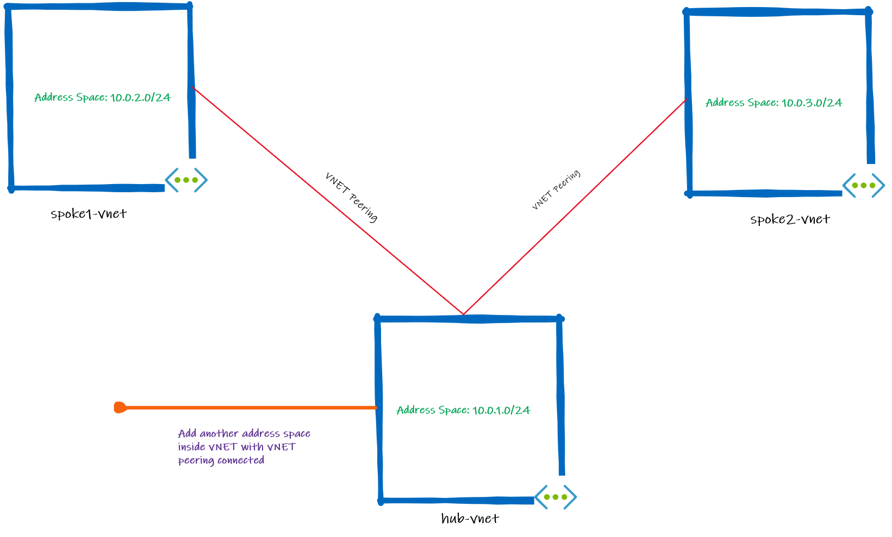
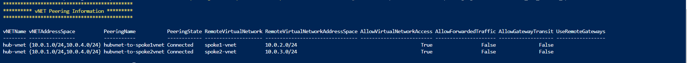

# Azure Networking Lab - Address Space Maintance with vNET Peering

## Introduction

This script dumps all vNET peering information with their relationship and will export all information to a backup file. You will set up the new address space on vNET with vNET peering connected from the virtual network address space file.

## Prerequisites

- Install the Powershell [Az modules](https://docs.microsoft.com/pt-br/powershell/azure/install-az-ps?view=azps-5.1.0) or use the [Azure Cloud Shell](https://docs.microsoft.com/en-us/azure/cloud-shell/overview) to run it.
- Ensure you are properly logged in to your tenant and with a subscription selected. You can check that by using:

```powershell
Add-AzAccount #Logon on your Azure Tenant
Get-AzContext # Check you have selected the correct Azure Subscription
Set-AzContext -Subscription <Subscription Name> # Set appropriate Subscription
```
- Create new folder and Change directory:
```powershell
New-Item -Name vnetpeering-addess-spacemaintenace -ItemType Directory
cd ./vnet-peering-change-address
```
- Download powershell script from the GitHub repository:

```powershell
New-Item -Name vnetpeering-addess-spacemaintenace -ItemType Directory
Invoke-WebRequest -Uri https://raw.githubusercontent.com/adicout/lab/master/Network/vnet-peering-change-address/azure-vnetpeering-addess-spacemaintenace.ps1 -OutFile azure-vnetpeering-addess-spacemaintenace.ps1
```
## Known Issues

- After you establish a vNET peering is it not possible to change the address spaces inside virtual network without removing the vNET peering.

## Script
- Save the powershell script file (*azure-vnetpeering-addess-spacemaintenace.ps1*) in a specific path and add the required parameters:
    - **$vnetname** = "Add Virtual Network Name"
    - **$rg** = "Add Resource Group Virtual Network"
    - **$addvnetPath** = "Inform path and file name with extesion to Add the address space inside vNET. For    example: c:\temp\vnet.txt"

Run the command:

```powershell
azure-vnetpeering-addess-spacemaintenace.ps1 -vnetname vNETName -rg ResourceGroup -addvnetPath FullFilePath
```
## Lab
In this lab, you will setup two virtual networks in a hub-and-spoke design and configure an Azure Private Peering between both vNETs. You will execute the Powershell script to print the peering information, take a backup of all virtual network information and add new address space into the hub vNET using a file with a .txt extension. 

See the base topology:



Create the Lab environment using the Powershell inside Azure Cloud Shell.

1. To start Azure Cloud Shell:

    - Select the Cloud Shell button on the menu bar at the upper right in the Azure portal. ->

    

2. Wait for the windows appear and enter into the prompt with the following information:

```powershell
** Virtual Networks**
New-AzResourceGroup -Name lab-adressSpace-maintance-vnetpeering-rg -Location eastus2
$virtualNetwork01 = New-AzVirtualNetwork -ResourceGroupName lab-adressSpace-maintance-vnetpeering-rg -Location eastus2 -Name hub-vnet -AddressPrefix 10.0.1.0/24
$subnetConfig01 = Add-AzVirtualNetworkSubnetConfig -Name hubSubnet -AddressPrefix 10.0.1.0/24 -VirtualNetwork $virtualNetwork01
$virtualNetwork01 | Set-AzVirtualNetwork
$virtualNetwork02 = New-AzVirtualNetwork -ResourceGroupName lab-adressSpace-maintance-vnetpeering-rg -Location eastus2 -Name spoke1-vnet -AddressPrefix 10.0.2.0/24
$subnetConfig02 = Add-AzVirtualNetworkSubnetConfig -Name spoke1Subnet -AddressPrefix 10.0.2.0/24 -VirtualNetwork $virtualNetwork02
$virtualNetwork02 | Set-AzVirtualNetwork
$virtualNetwork03 = New-AzVirtualNetwork -ResourceGroupName lab-adressSpace-maintance-vnetpeering-rg -Location eastus2 -Name spoke2-vnet -AddressPrefix 10.0.3.0/24
$subnetConfig03 = Add-AzVirtualNetworkSubnetConfig -Name spoke2Subnet -AddressPrefix 10.0.3.0/24 -VirtualNetwork $virtualNetwork03
$virtualNetwork03 | Set-AzVirtualNetwork
```

```powershell
** vNET Peering**
Add-AzVirtualNetworkPeering -Name hubvnet-to-spoke1vnet -VirtualNetwork $virtualNetwork01 -RemoteVirtualNetworkId $virtualNetwork02.Id
Add-AzVirtualNetworkPeering -Name spoke1vnet-to-hubvnet -VirtualNetwork $virtualNetwork02 -RemoteVirtualNetworkId $virtualNetwork01.Id
Add-AzVirtualNetworkPeering -Name hubvnet-to-spoke2vnet -VirtualNetwork $virtualNetwork01 -RemoteVirtualNetworkId $virtualNetwork03.Id
Add-AzVirtualNetworkPeering -Name spoke2vnet-to-hubvnet -VirtualNetwork $virtualNetwork03 -RemoteVirtualNetworkId $virtualNetwork01.Id
```

3. Create a file to add the new address space that you would like to insert in your virtual network. Run follow command on Powershell:

```powershell
New-Item "add_new_address_space.txt" -ItemType File -Value "10.0.5.0/24" 
```
4. Run the Powershell script to get vNET peering information and add new address space inside of virtual network (hub-vnet). Run the following command:

```powershell
azure-vnetpeering-addess-spacemaintenace.ps1 -vnetname hub-vnet -rg lab-adressSpace-maintance-vnetpeering-rg  -addvnetPath add_new_address_space.txt
```
**Output below will show a summary of vNET Peering Information and process to add new address space inside of virtual network.**



***Figure 1 - vNET Peering Information***


***Figure 2 - The process to add new address space, remove peering and restabish again***

  > Note: Choice **"Yes" [y]** or **"No [n]"** to follow the procedure to add a new address space inside the virtual network.

## Clean All Resources after the hands-on lab

After you have successfully completed the lab, you will want to delete the Resource Groups.Run the following command on Azure Cloud Shell:

```powershell
Get-AzureRmResourceGroup -Name "lab-adressSpace-maintance-vnetpeering-rg" | Remove-AzureRmResourceGroup -Verbose -Force
```
## Contributing
Pull requests are welcome. For major changes. Please make sure to update tests as appropriate.
