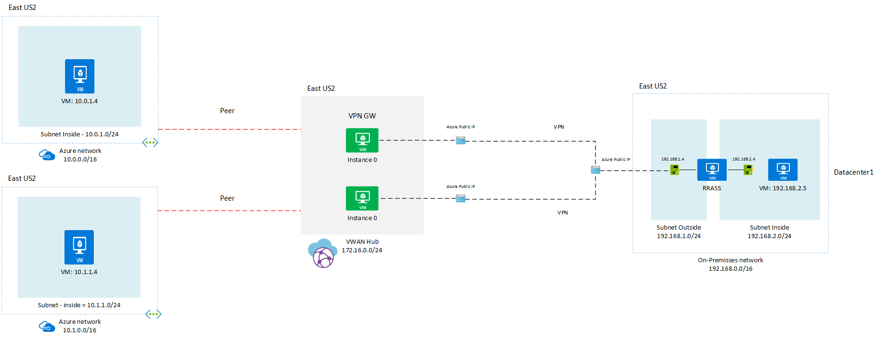

## Azure Networking Lab - Azure Virtual WAN - Site to Site VPN with Windows RRAS 

This lab will illustrate how to build a basic Virtual WAN infrastructure including an on-premise datacenter. The focus of lab is for testing purposes only and you should not be considered for production enviroments. The lab builds on-premises VNETs allowing you to simulate your local infrastructure. The local datacenter connect to the VWAN hub via an IPSEC/IKEv2 tunnel that is also connected to two VNETs. At the end of the lab, the local datacenter (simulate by on-premise Vnet) will be able to connect to the VNETs as well as each other through the tunnel. The base infrastructure configurations for the on-premise environments will not be described in detail. The main goal is to quickly build a test VWAN environment. You need to access the portal to download the configuration file of VWAN to determine the public IPs of the VPN gateways. All other configs are will done by Azure CLI and/or Windows RRASS so you can change them as needed to match your environment if you prefer.

**Requirements:**

- Valid the Azure subscription account. If you don’t have one, you can create your free azure account (https://azure.microsoft.com/en-us/free/).
- Latest Azure CLI, you can follow these instructions to install: https://docs.microsoft.com/en-us/cli/azure/install-azure-cli
- Check out the Azure Virtual WAN Concepts: https://docs.microsoft.com/en-us/azure/virtual-wan/virtual-wan-global-transit-network-architecture

   
> [!NOTE]
> - Azure CLI and Cloud Shell for VWAN are in preview and require the "virtual-wan" extension. You can view the extensions by running "az extension list-available --output table". Install the extension "az extension add --name virtual-wan".


<span style="font-size:2em">**Azure Virtual WAN Lab Architecture** </span>




Create the Virtual WAN hub that allows on prem to on prem to hairpin through the tunnel. The address space used should not overlap. VWAN deploys 2 "appliances" as well as a number of underlying components. We're starting here as the last command can take 30+ minutes to deploy. By specifying "--no-wait", you can move on to other steps while this section of VWAN continues to deploy in the background. 

```Azure CLI
az group create --name LAB-EASTUS2VWAN-RG --location eastus2
az network vwan create --name EASTUS2VWAN --resource-group LAB-EASTUS2VWAN-RG --branch-to-branch-traffic true --location eastus2 --vnet-to-vnet-traffic true
az network vhub create --address-prefix 192.168.0.0/24 --name EASTUS2VWANHUB --resource-group LAB-EASTUS2VWAN-RG --vwan EASTUS2VWAN --location eastus2
az network vpn-gateway create --name EASTUS2VWAN --resource-group LAB-EASTUS2VWAN-RG --vhub EASTUS2VWANHUB --location eastus2 --no-wait
```
Deploy the infrastructure for on-premise Datacenter 1 (192.168.0.0/16). This builds out all of the VNET/subnet/routing/VMs needed to simulate on-premises including a Windows RRASS and Windows test VM.

```Azure CLI
az group create --name LAB-DC1-RG --location eastus2
az network vnet create --resource-group LAB-DC1-RG --name LAB-DC1-Vnet --location eastus2 --address-prefixes 192.168.0.0/16 --subnet-name outside --subnet-prefix 192.168.1.0/24
az network vnet subnet create --address-prefix 192.168.2.0/24 --name inside --resource-group LAB-DC1-RG --vnet-name LAB-DC1-Vnet

az network public-ip create --name ws2016rrass-pip --resource-group LAB-DC1-RG --idle-timeout 30 --allocation-method Static
az network nic create --name ws2016rrass-nic01 -g LAB-DC1-RG --subnet outside --vnet LAB-DC1-Vnet --public-ip-address ws2016rrass-pip --ip-forwarding true --private-ip-address 192.168.1.4
az network nic create --name ws2016rrass-nic02 -g LAB-DC1-RG --subnet inside --vnet LAB-DC1-Vnet --ip-forwarding true --private-ip-address 192.168.2.4
az vm create --resource-group LAB-DC1-RG --location eastus2 --name WSRRAS --size Standard_D2_v2 --nics ws2016rrass-nic01 ws2016rrass-nic02  --image win2016datacenter --admin-username azureuser --admin-password Msft@123456@ --no-wait

az network public-ip create --name ws2016server-pip --resource-group LAB-DC1-RG --location eastus2 --allocation-method Dynamic
az network nic create --resource-group LAB-DC1-RG -n ws2016server-nic --location eastus2 --subnet inside --vnet-name LAB-DC1-Vnet --public-ip-address ws2016server-pip --private-ip-address 192.168.2.5
az vm create -n ws2016servervm -g LAB-DC1-RG --image win2016datacenter --admin-username azureuser --admin-password Msft@123456@ --nics ws2016server-nic --no-wait


az network route-table create --name LAB-DC1-RT --resource-group LAB-DC1-RG
az network route-table route create --name connect-to-AzVNET01 --resource-group LAB-DC1-RG --route-table-name LAB-DC1-RT --address-prefix 10.0.0.0/16 --next-hop-type VirtualAppliance --next-hop-ip-address 192.168.2.4
az network route-table route create --name connect-to-AzVNET02 --resource-group LAB-DC1-RG --route-table-name LAB-DC1-RT --address-prefix 10.1.0.0/16 --next-hop-type VirtualAppliance --next-hop-ip-address 192.168.2.4
az network vnet subnet update --name inside --vnet-name LAB-DC1-Vnet --resource-group LAB-DC1-RG --route-table LAB-DC1-RT

```